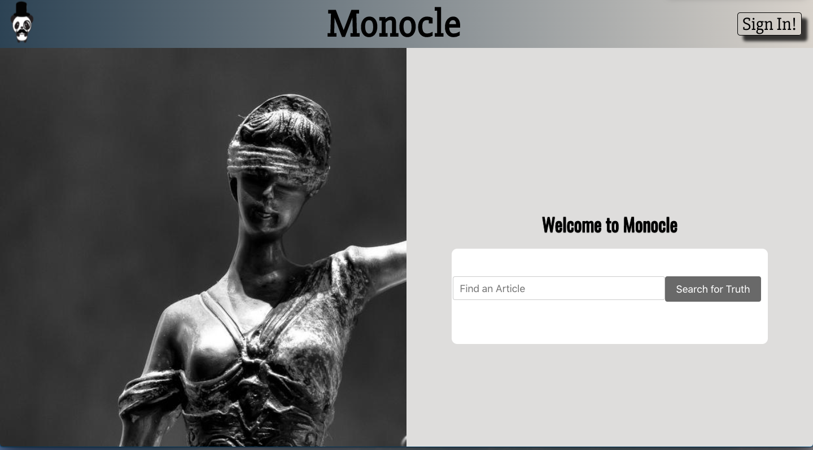
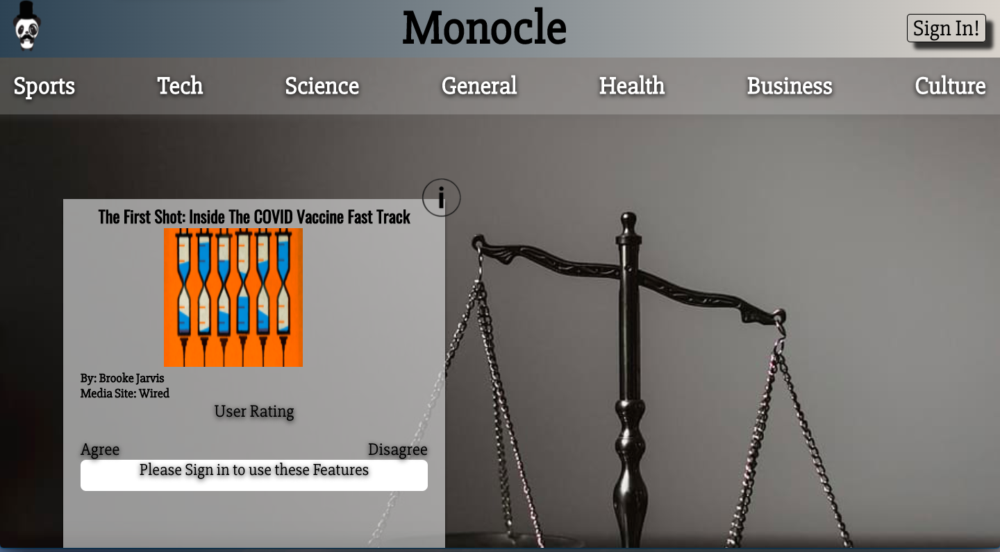
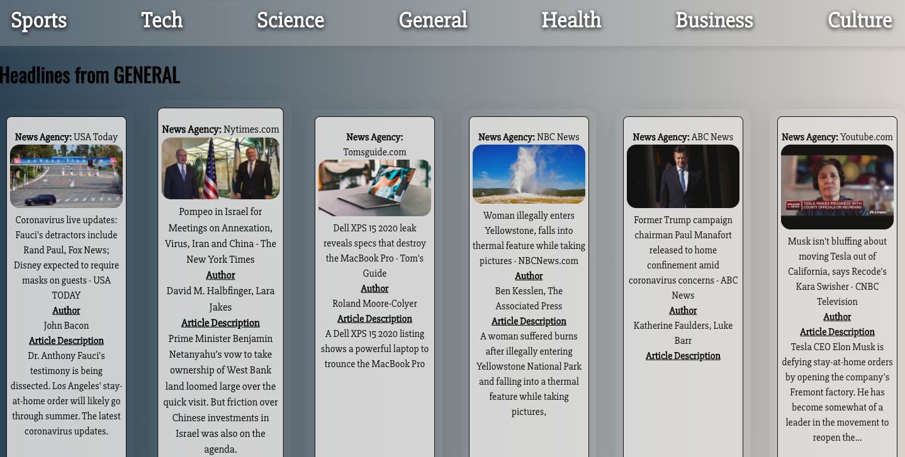
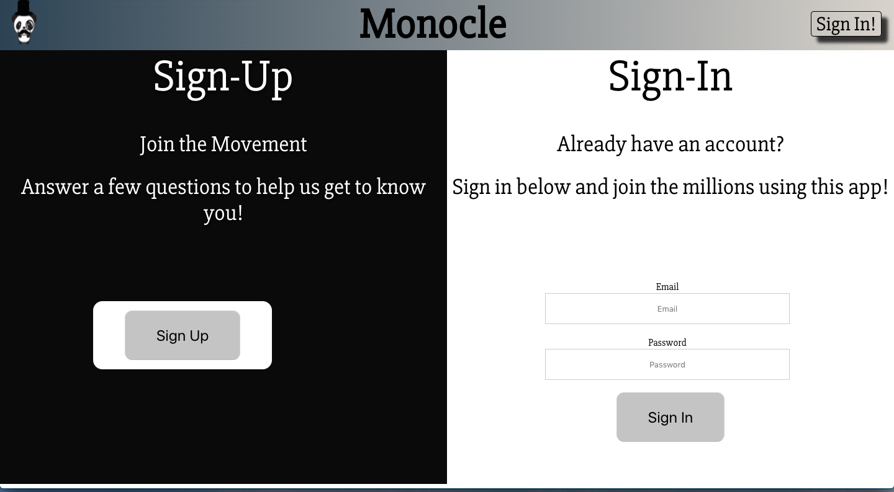
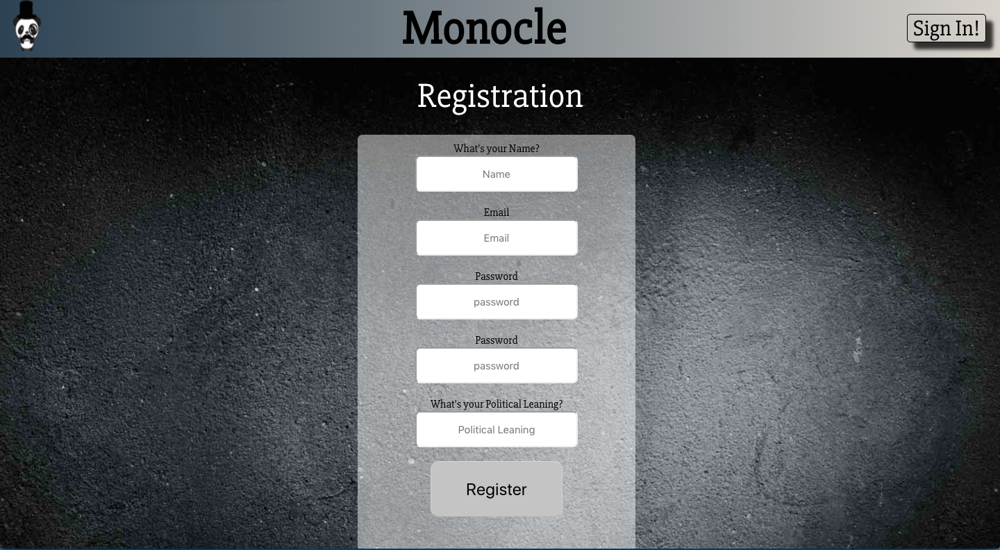
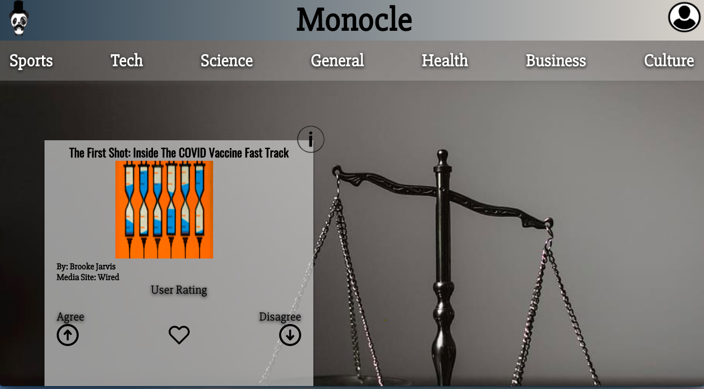
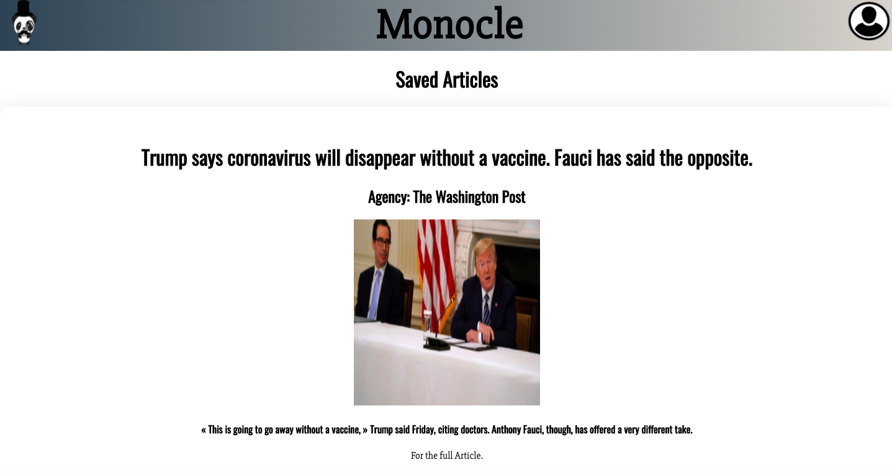
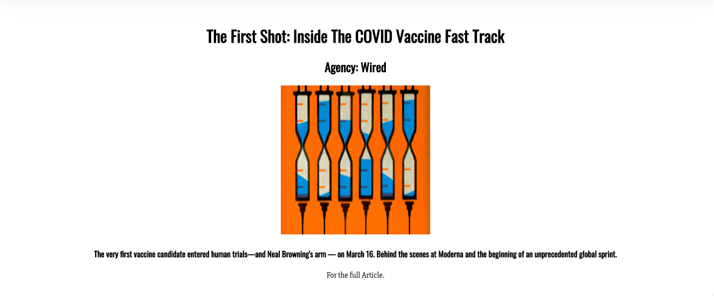

### Monocle Alpha Stage Project

Welcome to Monocle! This application is a user based rating site for news articles.
The purpose of the alpha stage site is to provide users with the ability to see, compare and rate news articles that get published daily.

---

### Landing Page

The landing Page of the site is purposefully black, white and gray in color to emulate the nature of reviewing and reading news. There is always a _gray area_. The user can then search for news articles (over 73 000) using the search bar (search bar can only read titles.. for now).

---

### Main Page

After searching for an article title, the user will be borught to this page, where they can view the article they searched up as well as a nav bar with categories.

As seen here, the user Rating section is barred by a sign-in requirement. Users must sign-in or create and account to use these features.

---

### Category Page

The category page includes the TOP headlines from various news agencies. It meant to offer quick brush ups on daily news but also add insight as to what certain news agencies consider "Headline News".

---

### Sign-in Page

The user can reach this page by clicking on the _Sign-In!_ icon in the header section. Once there, the user can either sign in or register a new account to gain access to the extra features on the site.

---

### Registraion Page

The Registration page asks simple questions and stores the user in a Mongo Database. On completion, the DB creates an empty array called _Articles_. This stores saved articles in the users Profile Page.

---

### Signed-In Features

Once signed in, users can like, agree or disagree with news articles with other users.

---

### Saved Articles

Users can save their favourite news articles and review them later. Saved articles get stored in the DB.

UI design is "work-in-progress" but the goal is to expand news articles to larger size for readability.

---

**_NEWS ARTICLE CONTENT IS NOT YET MADE AVAILABLE_**

---

## Future Updates will follow :).

---

### Long-Term Goals

1. Create a verison of this App were we (the admins) provide a content-analysis of the news articles. Ratings will be based on _Frame Analysis_, _Expert Reference_ and _Emotional Impact of Articles_ and _Political Leaning_. The goal is to provide both public user accounts and opinions of articles with a healthy backing of ruggid _Academic Content Analysis_.

2. Extend and update the Sign-up requirements to include questions surrounding _Socioeconomic Status of Users_, _Education Level_, _Recent Voting Pattern_, and finally, _Favourite News Agencies_. The goal is to solidify our understanding of our users with regards biases in the consumption of _News_.

3. Create an _Education Registration_ form to allow academia to use our data collected by the App. Data includes: _User Rated Opinion_, _Contentious Article Discussions By Users_, _Refined User Data with Voting Pattern (who's rating "what" and "how")_, etc.

4. Add more information and features around the _Profile Page_. It would be nice to have _Account Information_ stored on a separate section to allow users to see their registration information and even allow users to change some aspects of their information (political leaning, etc) during their time on the app.

---

## Stretch

1. Switch the Back-end from Node to Python or Java.

2. Add a friends list.

---

---

NEWS ARTICLES PROVIDED BY <a href="https://newsapi.org/">
**_NEWS API_** </a>
